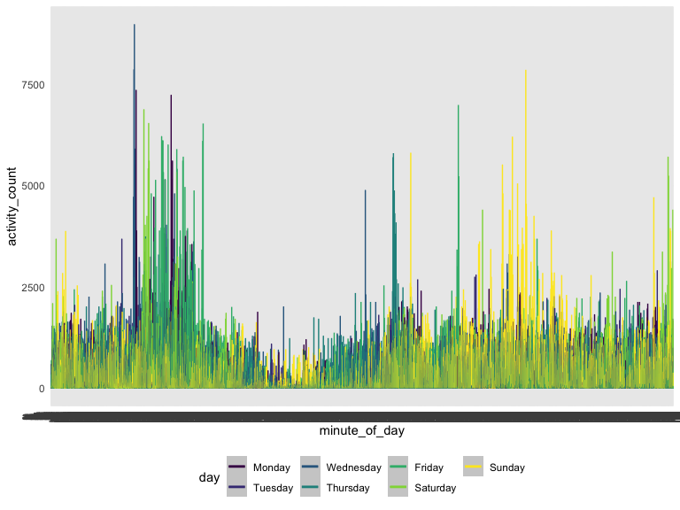
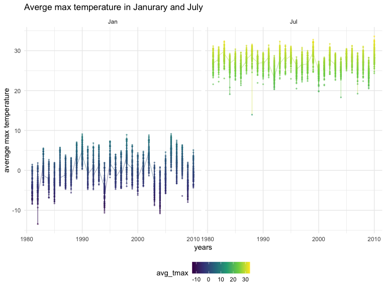
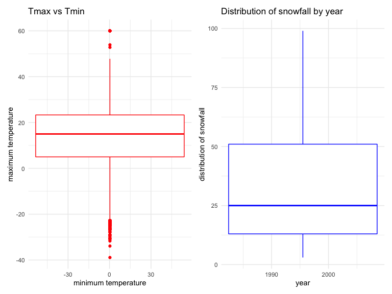

Homework 3
================
Mingee Choi
10/15/2022

Load Packages

``` r
library(tidyverse)
library(ggridges)
library(patchwork)
library(dplyr)
library(p8105.datasets)

knitr::opts_chunk$set(
    echo = TRUE,
    warning = FALSE,
    fig.width = 8, 
  fig.height = 6,
  out.width = "90%"
)

theme_set(theme_minimal() + theme(legend.position = "bottom"))

options(
  ggplot2.continuous.colour = "viridis",
  ggplot2.continuous.fill = "viridis"
)

scale_colour_discrete = scale_colour_viridis_d
scale_fill_discrete = scale_fill_viridis_d
```

# Problem 2

\####Load, tidy, and wrangle accel_data.csv

``` r
accel_df =
  read_csv("./data/accel_data.csv")%>%
  janitor::clean_names()%>%
  pivot_longer(
    activity_1:activity_1440,
    names_to = "minute_of_day",
    values_to = "activity_count"
  )%>%
  mutate(weekend_weekday = ifelse(day %in% c("Friday", "Saturday", "Sunday"), "weekend", "weekday"))%>%
  mutate(day=as.factor(day))%>%
  mutate(weekend_weekday=as.factor(weekend_weekday))%>%
  select(week, day_id, day, weekend_weekday, everything())
```

    ## Rows: 35 Columns: 1443
    ## ── Column specification ────────────────────────────────────────────────────────
    ## Delimiter: ","
    ## chr    (1): day
    ## dbl (1442): week, day_id, activity.1, activity.2, activity.3, activity.4, ac...
    ## 
    ## ℹ Use `spec()` to retrieve the full column specification for this data.
    ## ℹ Specify the column types or set `show_col_types = FALSE` to quiet this message.

This dataset contains `50,400` observations of `6` variables. Variables
include week, day_id, day, weekend_weekday, activity_count, and
minute_of_day.

\####Aggregate across minutes to create a total activity variable for
each day, create a table, and look at trends

``` r
  accel_df$day = ordered(accel_df$day, levels=c("Monday", "Tuesday", "Wednesday", "Thursday", "Friday", "Saturday", "Sunday"))
  accel_df %>%
  group_by(week, day) %>%
  summarize(total_activity = sum(activity_count))%>%
 pivot_wider(
   names_from = day,
   values_from = total_activity
 ) %>%
    knitr::kable(digits = 1)
```

    ## `summarise()` has grouped output by 'week'. You can override using the
    ## `.groups` argument.

| week |   Monday |  Tuesday | Wednesday | Thursday |   Friday | Saturday | Sunday |
|-----:|---------:|---------:|----------:|---------:|---------:|---------:|-------:|
|    1 |  78828.1 | 307094.2 |    340115 | 355923.6 | 480542.6 |   376254 | 631105 |
|    2 | 295431.0 | 423245.0 |    440962 | 474048.0 | 568839.0 |   607175 | 422018 |
|    3 | 685910.0 | 381507.0 |    468869 | 371230.0 | 467420.0 |   382928 | 467052 |
|    4 | 409450.0 | 319568.0 |    434460 | 340291.0 | 154049.0 |     1440 | 260617 |
|    5 | 389080.0 | 367824.0 |    445366 | 549658.0 | 620860.0 |     1440 | 138421 |

There aren’t any obvious trends, but our 63 year-old male study was
slightly more active on Monday and Friday than Tuesday-Thursday and
Saturday. He was least active on Saturday, especially for week 4 and 5.

\####Make a single-panel plot that shows the 24-hour activity time
courses for each day

``` r
accel_df %>%
  mutate(minute_of_day = as.numeric(minute_of_day))
```

    ## # A tibble: 50,400 × 6
    ##     week day_id day    weekend_weekday minute_of_day activity_count
    ##    <dbl>  <dbl> <ord>  <fct>                   <dbl>          <dbl>
    ##  1     1      1 Friday weekend                    NA           88.4
    ##  2     1      1 Friday weekend                    NA           82.2
    ##  3     1      1 Friday weekend                    NA           64.4
    ##  4     1      1 Friday weekend                    NA           70.0
    ##  5     1      1 Friday weekend                    NA           75.0
    ##  6     1      1 Friday weekend                    NA           66.3
    ##  7     1      1 Friday weekend                    NA           53.8
    ##  8     1      1 Friday weekend                    NA           47.8
    ##  9     1      1 Friday weekend                    NA           55.5
    ## 10     1      1 Friday weekend                    NA           43.0
    ## # … with 50,390 more rows

``` r
accel_df %>%
  ggplot(aes(x=minute_of_day, y=activity_count, color = day)) + 
  geom_line() +
  geom_smooth(alpha = 0.5)
```

    ## `geom_smooth()` using method = 'loess' and formula 'y ~ x'



``` r
labs(
    title = "24-hour activity time courses for each day",
    x = "minute of day",
    y = "activity count"
  ) 
```

    ## $x
    ## [1] "minute of day"
    ## 
    ## $y
    ## [1] "activity count"
    ## 
    ## $title
    ## [1] "24-hour activity time courses for each day"
    ## 
    ## attr(,"class")
    ## [1] "labels"

From the graph, it seems as if our study is least active on Tuesday and
Thursday and most active on Friday, Sunday, and Monday.

# Problem 3

\####load dataset

``` r
data("ny_noaa")%>%
summary(ny_noaa)
```

    ##    Length     Class      Mode 
    ##         1 character character

NY NOAA contains 2,595,176 observations of 7 variables and contains the
variables id, date, prcp, snow, snwd, tmax, and tmin.’id’ represents
weather station ID, ‘prcp’ represents precipitation(tenths of mm),
‘snwd’ represents snow depth, ‘tmax’ represents maximum temperature, and
‘tmin’ represents minimum temperature. There are 591,786 total missing
values; missing values are a serious issue in this data set, espcially
for snowfall.

\####Data cleaning

``` r
ny_noaa_tidy = ny_noaa%>%
janitor::clean_names()%>%
separate(date, into=c("year", "month", "day"))%>%
  mutate(month = month.abb[as.numeric(month)])%>% 
  mutate(
    tmax = as.numeric(tmax) / 10,
    tmin = as.numeric(tmin) / 10,
    prcp = as.numeric(prcp) / 10,
  )

mode = function(){
    return(sort(-table(ny_noaa$snow))[1])
}
mode()
```

    ##        0 
    ## -2008508

The most commonly observed value is 0 because snow usually comes down
during winter and not during the other seasons.

\####Two-panel plot showing average max temperature in Jan. and in July
in each station across years

``` r
ny_noaa_tidy%>%
  filter(month %in% c("Jan", "Jul"))%>%
  group_by(id, year, month)%>%
  summarize(avg_tmax = mean(tmax, rm.na = TRUE)) %>%
    ggplot(aes(x=as.numeric(year), y=avg_tmax, color=avg_tmax))+
    geom_line(alpha = 0.4) +
    geom_point(alpha = 0.5, size = 0.5) +
    scale_x_continuous(breaks = c(1980, 1990, 2000, 2010)) +
    labs(
      title = "Averge max temperature in Janurary and July",
      x = "years",
      y = "average max temperature"
    ) +
      facet_grid(~month)
```

    ## `summarise()` has grouped output by 'id', 'year'. You can override using the
    ## `.groups` argument.


Average max temperature in July was much higher than January.
Temperatures are relatively stable except there was one large dip
(potential outlier) in average max temperature in July between
1985-1990.

\####Two-panel plot showing tmax vs tmin for full dataset and make a
plot showing distribution of snowfall values greater than 0 and less
than 100 separately by year

``` r
plot1 = ny_noaa_tidy%>%
  ggplot(aes(x=tmin, y=tmax, rm.na = TRUE)) +
  geom_boxplot(color='red') +
  labs(
    title= "Tmax vs Tmin",
    x = "minimum temperature",
    y = "maximum temperature"
  )

plot2 = ny_noaa_tidy%>%
  filter(snow> 0 & snow < 100) %>%
  ggplot(aes(x=as.numeric(year), y=snow)) +
  geom_boxplot(color ='blue') +
  scale_x_continuous(breaks = c(1980, 1990, 2000, 2010)) +
  labs(
    title= "Distribution of snowfall by year",
    x = "year",
    y = "distribution of snowfall"
  )
plot1 + plot2
```


